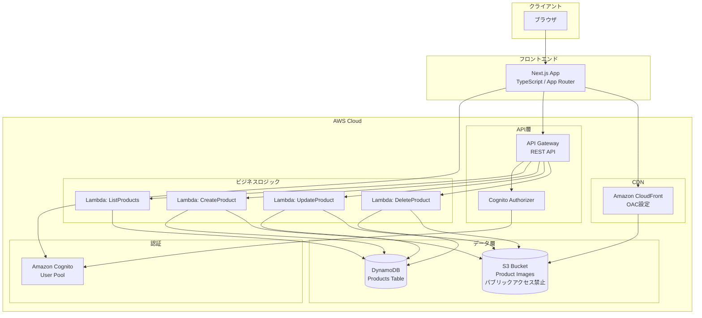
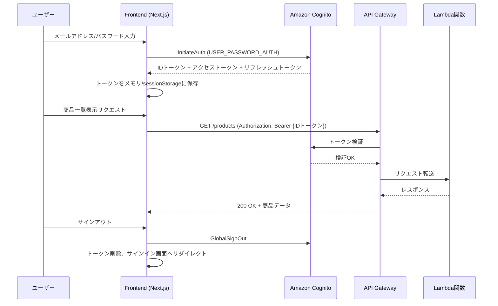

# 技術設計書: 商品情報管理Webアプリケーション

## 概要（Overview）

本設計書は、商品情報管理Webアプリケーションの技術設計を定義する。本アプリケーションはAWSサーバーレスアーキテクチャを基盤とし、Next.js（TypeScript）フロントエンドとAWS SAMで管理されるバックエンドで構成される。

### 技術スタック

| レイヤー | 技術 |
|---------|------|
| フロントエンド | Next.js (TypeScript) |
| API | Amazon API Gateway (REST API) |
| 認証 | Amazon Cognito User Pool |
| ビジネスロジック | AWS Lambda (Python 3.13) |
| データストア | Amazon DynamoDB |
| 画像ストレージ | Amazon S3 |
| 画像配信 | Amazon CloudFront (OAC) |
| IaC | AWS SAM (template.yaml) |

### 設計方針

- **App Router**: Next.jsはApp Routerを使用し、Server Components/Client Componentsの分離を活用する
- **サーバーレス**: バックエンドは完全サーバーレスで運用コストを最小化する
- **分離**: フロントエンドとバックエンドを独立したディレクトリで管理し、独立デプロイを可能にする
- **セキュリティ**: Cognito認証トークンによるAPI保護を全エンドポイントに適用する
- **画像配信セキュリティ**: S3バケットへの直接アクセスを禁止し、CloudFront OAC経由でのみ画像を配信する

## アーキテクチャ（Architecture）

### High-Level Architecture



### 認証フロー



### プロジェクトディレクトリ構造

```
product-management/
├── frontend/                    # フロントエンド (Next.js App Router)
│   ├── package.json
│   ├── tsconfig.json
│   ├── next.config.js
│   ├── public/
│   │   └── placeholder.png     # デフォルト商品画像
│   └── src/
│       ├── app/
│       │   ├── layout.tsx      # ルートレイアウト
│       │   ├── page.tsx        # 商品一覧画面（認証後のホーム）
│       │   ├── login/
│       │   │   └── page.tsx    # サインイン画面
│       │   └── products/
│       │       ├── new/
│       │       │   └── page.tsx # 商品追加画面
│       │       └── [id]/
│       │           └── edit/
│       │               └── page.tsx # 商品編集画面
│       ├── components/
│       │   ├── Layout.tsx      # 共通レイアウト（ヘッダー等）
│       │   ├── ProductList.tsx # 商品一覧コンポーネント
│       │   ├── ProductForm.tsx # 商品入力フォーム
│       │   └── DeleteDialog.tsx # 削除確認ダイアログ
│       ├── lib/
│       │   ├── auth.ts         # Cognito認証ユーティリティ
│       │   ├── api.ts          # APIクライアント
│       │   └── types.ts        # 型定義
│       └── styles/
│           └── globals.css     # グローバルスタイル
├── backend/                     # バックエンド (AWS SAM)
│   ├── template.yaml           # SAMテンプレート
│   ├── samconfig.toml          # SAMデプロイ設定
│   └── src/
│       ├── handlers/
│       │   ├── __init__.py
│       │   ├── list_products.py    # 商品一覧取得
│       │   ├── create_product.py   # 商品追加
│       │   ├── update_product.py   # 商品更新
│       │   └── delete_product.py   # 商品削除
│       ├── models/
│       │   ├── __init__.py
│       │   └── product.py          # 商品モデル
│       ├── utils/
│       │   ├── __init__.py
│       │   ├── response.py         # レスポンスヘルパー
│       │   ├── validation.py       # バリデーション
│       │   └── image.py            # 画像処理ユーティリティ
│       └── requirements.txt        # Python依存パッケージ
└── README.md
```

## コンポーネントとインターフェース（Components and Interfaces）

### API設計

#### ベースURL

```
https://{api-id}.execute-api.{region}.amazonaws.com/{stage}
```

#### エンドポイント一覧

| メソッド | パス | 説明 | 認証 |
|---------|------|------|------|
| GET | /products | 商品一覧取得 | 必須 |
| POST | /products | 商品追加 | 必須 |
| PUT | /products/{productId} | 商品更新 | 必須 |
| DELETE | /products/{productId} | 商品削除 | 必須 |

#### GET /products - 商品一覧取得

**リクエスト:**
```
GET /products
Authorization: Bearer {id_token}
```

**レスポンス (200 OK):**
```json
{
  "products": [
    {
      "productId": "prod-uuid-1234",
      "productName": "サンプル商品",
      "price": 1980,
      "description": "商品の説明文",
      "imageUrl": "https://d1234567890.cloudfront.net/products/prod-uuid-1234/img-abc.jpg",
      "createdAt": "2024-01-01T00:00:00Z",
      "updatedAt": "2024-01-01T00:00:00Z"
    }
  ]
}
```

#### POST /products - 商品追加

**リクエスト:**
```
POST /products
Authorization: Bearer {id_token}
Content-Type: multipart/form-data

productName: string (必須)
price: number (必須)
description: string (任意)
image: file (任意, JPEG/PNG/WebP)
```

**レスポンス (201 Created):**
```json
{
  "product": {
    "productId": "prod-uuid-5678",
    "productName": "新商品",
    "price": 2980,
    "description": "新商品の説明",
    "imageUrl": "https://d1234567890.cloudfront.net/products/prod-uuid-5678/img-xyz.jpg",
    "createdAt": "2024-01-15T10:30:00Z",
    "updatedAt": "2024-01-15T10:30:00Z"
  }
}
```

**エラーレスポンス (400 Bad Request):**
```json
{
  "error": "ValidationError",
  "message": "商品名称は必須です"
}
```

#### PUT /products/{productId} - 商品更新

**リクエスト:**
```
PUT /products/{productId}
Authorization: Bearer {id_token}
Content-Type: multipart/form-data

productName: string (必須)
price: number (必須)
description: string (任意)
image: file (任意, JPEG/PNG/WebP)
```

**レスポンス (200 OK):**
```json
{
  "product": {
    "productId": "prod-uuid-5678",
    "productName": "更新後の商品名",
    "price": 3980,
    "description": "更新後の説明",
    "imageUrl": "https://d1234567890.cloudfront.net/products/prod-uuid-5678/img-new.jpg",
    "createdAt": "2024-01-15T10:30:00Z",
    "updatedAt": "2024-01-16T14:00:00Z"
  }
}
```

**エラーレスポンス (404 Not Found):**
```json
{
  "error": "NotFoundError",
  "message": "指定された商品が見つかりません"
}
```

#### DELETE /products/{productId} - 商品削除

**リクエスト:**
```
DELETE /products/{productId}
Authorization: Bearer {id_token}
```

**レスポンス (200 OK):**
```json
{
  "message": "商品を削除しました"
}
```

### Lambda関数設計

#### ListProducts関数

- **ランタイム**: Python 3.13
- **ハンドラ**: `src/handlers/list_products.handler`
- **メモリ**: 256MB
- **タイムアウト**: 10秒
- **環境変数**: `PRODUCTS_TABLE_NAME`, `CLOUDFRONT_DOMAIN`
- **処理フロー**:
  1. DynamoDBからScanで全商品取得
  2. 各商品の画像キーに対してCloudFront URLを生成（`https://{CLOUDFRONT_DOMAIN}/{imageKey}`）
  3. レスポンス返却

#### CreateProduct関数

- **ランタイム**: Python 3.13
- **ハンドラ**: `src/handlers/create_product.handler`
- **メモリ**: 256MB
- **タイムアウト**: 30秒
- **環境変数**: `PRODUCTS_TABLE_NAME`, `IMAGE_BUCKET_NAME`, `CLOUDFRONT_DOMAIN`
- **処理フロー**:
  1. リクエストボディのパース・バリデーション
  2. UUIDで商品ID生成
  3. 画像ファイルがある場合、S3にアップロード
  4. DynamoDBに商品情報を保存
  5. CloudFront URLを含むレスポンス返却

**multipart/form-dataパーサー実装上の注意点:**
- API Gatewayの `BinaryMediaTypes` 設定により、リクエストボディはbase64エンコードされて到達する。`isBase64Encoded` フラグを確認してデコードすること。
- boundaryで分割した各パートの先頭に付く `\r\n` を除去する処理が必要。これを行わないと、画像ファイルのバイナリデータの先頭にゴミバイトが入り、マジックバイト検証（JPEG: `FF D8 FF`、PNG: `89 50 4E 47`）が失敗する。
- `part.startswith(b"--")` で終端マーカーをスキップする処理を追加すること。multipartの最終パートの後に `--{boundary}--` という終端マーカーが存在する。

#### UpdateProduct関数

- **ランタイム**: Python 3.13
- **ハンドラ**: `src/handlers/update_product.handler`
- **メモリ**: 256MB
- **タイムアウト**: 30秒
- **環境変数**: `PRODUCTS_TABLE_NAME`, `IMAGE_BUCKET_NAME`, `CLOUDFRONT_DOMAIN`
- **処理フロー**:
  1. パスパラメータから商品ID取得
  2. DynamoDBから既存商品情報取得（存在確認）
  3. リクエストボディのパース・バリデーション
  4. 画像変更がある場合、新画像をS3にアップロード、旧画像を削除
  5. DynamoDBの商品情報を更新
  6. CloudFront URLを含むレスポンス返却

#### DeleteProduct関数

- **ランタイム**: Python 3.13
- **ハンドラ**: `src/handlers/delete_product.handler`
- **メモリ**: 256MB
- **タイムアウト**: 10秒
- **環境変数**: `PRODUCTS_TABLE_NAME`, `IMAGE_BUCKET_NAME`
- **処理フロー**:
  1. パスパラメータから商品ID取得
  2. DynamoDBから既存商品情報取得（画像キー確認）
  3. 画像が存在する場合、S3から削除
  4. DynamoDBから商品情報を削除
  5. レスポンス返却

### フロントエンドコンポーネント設計

#### ページコンポーネント

| ページ | パス | ファイル | 説明 |
|--------|------|---------|------|
| LoginPage | /login | `app/login/page.tsx` | サインイン画面 |
| ProductListPage | / | `app/page.tsx` | 商品一覧画面（認証後のホーム） |
| NewProductPage | /products/new | `app/products/new/page.tsx` | 商品追加画面 |
| EditProductPage | /products/[id]/edit | `app/products/[id]/edit/page.tsx` | 商品編集画面 |

#### 共通コンポーネント

| コンポーネント | 説明 |
|---------------|------|
| Layout | ヘッダー（サインアウトボタン含む）とメインコンテンツのレイアウト |
| ProductList | 商品カード一覧表示、編集・削除ボタン付き |
| ProductForm | 商品情報入力フォーム（追加・編集共用） |
| DeleteDialog | 削除確認モーダルダイアログ |

#### フロントエンド実装上の注意点

**認証チェックとUI表示制御 (page.tsx):**
- `authChecked` ステートを導入し、認証確認が完了するまでUIを一切表示しない（`return null`）。これにより、未認証時にヘッダーや「読み込み中...」が一瞬表示されるフラッシュ問題を防止する。

**LoginPageのルーティング (login/page.tsx):**
- 認証済みユーザーのリダイレクト（`router.push`）はレンダリング中に直接呼び出さず、`useEffect` 内で実行すること。レンダリング中に呼び出すと "Cannot update a component while rendering a different component" というReact警告が発生する。

**next/image コンポーネント (ProductList.tsx):**
- `Image` コンポーネントの `style` で `width` と `height` の両方を指定する場合、`height: 'auto'` を使用すること。`height: '200px'` のように固定値を指定すると、Next.jsが "width or height modified, but not the other" 警告を出す。

#### 認証ライブラリ (lib/auth.ts)

```typescript
interface AuthService {
  signIn(email: string, password: string): Promise<AuthResult>;
  signOut(): Promise<void>;
  getIdToken(): Promise<string | null>;
  isAuthenticated(): boolean;
}
```

**実装上の注意点:**
- `amazon-cognito-identity-js` の `authenticateUser` 呼び出し前に `cognitoUser.setAuthenticationFlowType('USER_PASSWORD_AUTH')` を明示的に指定すること。ライブラリのデフォルトは `USER_SRP_AUTH` だが、Cognito User Pool Clientには `USER_PASSWORD_AUTH` のみ有効にしているため、明示指定しないと認証が失敗する。

#### APIクライアント (lib/api.ts)

```typescript
interface ProductApiClient {
  listProducts(): Promise<Product[]>;
  createProduct(data: ProductFormData): Promise<Product>;
  updateProduct(productId: string, data: ProductFormData): Promise<Product>;
  deleteProduct(productId: string): Promise<void>;
}
```

### SAMテンプレート設計

```yaml
AWSTemplateFormatVersion: '2010-09-09'
Transform: AWS::Serverless-2016-10-31
Description: 商品情報管理アプリケーション バックエンド

Parameters:
  StageName:
    Type: String
    Default: dev
    AllowedValues:
      - dev
      - staging
      - prod

Globals:
  Function:
    Runtime: python3.13
    MemorySize: 256
    Timeout: 30
    CodeUri: ./
    Environment:
      Variables:
        PRODUCTS_TABLE_NAME: !Ref ProductsTable
        IMAGE_BUCKET_NAME: !Ref ImageBucket
        CLOUDFRONT_DOMAIN: !GetAtt ImageDistribution.DomainName

Resources:
  # Cognito User Pool
  UserPool:
    Type: AWS::Cognito::UserPool
    Properties:
      UserPoolName: !Sub product-management-users-${StageName}
      AdminCreateUserConfig:
        AllowAdminCreateUserOnly: true
      AutoVerifiedAttributes:
        - email
      UsernameAttributes:
        - email
      Policies:
        PasswordPolicy:
          MinimumLength: 8
          RequireUppercase: true
          RequireLowercase: true
          RequireNumbers: true
          RequireSymbols: false

  UserPoolClient:
    Type: AWS::Cognito::UserPoolClient
    Properties:
      ClientName: !Sub product-management-client-${StageName}
      UserPoolId: !Ref UserPool
      ExplicitAuthFlows:
        - ALLOW_USER_PASSWORD_AUTH
        - ALLOW_REFRESH_TOKEN_AUTH
      GenerateSecret: false

  # API Gateway
  ProductApi:
    Type: AWS::Serverless::Api
    Properties:
      StageName: !Ref StageName
      BinaryMediaTypes:
        - "multipart/form-data"
      Auth:
        DefaultAuthorizer: CognitoAuthorizer
        AddDefaultAuthorizerToCorsPreflight: false
        Authorizers:
          CognitoAuthorizer:
            UserPoolArn: !GetAtt UserPool.Arn
      Cors:
        AllowMethods: "'GET,POST,PUT,DELETE,OPTIONS'"
        AllowHeaders: "'Content-Type,Authorization'"
        AllowOrigin: "'*'"

  # Lambda Functions
  ListProductsFunction:
    Type: AWS::Serverless::Function
    Properties:
      FunctionName: !Sub ${AWS::StackName}-list-products
      Handler: src/handlers/list_products.handler
      Timeout: 10
      Policies:
        - DynamoDBReadPolicy:
            TableName: !Ref ProductsTable
      Events:
        GetProducts:
          Type: Api
          Properties:
            RestApiId: !Ref ProductApi
            Path: /products
            Method: GET

  CreateProductFunction:
    Type: AWS::Serverless::Function
    Properties:
      FunctionName: !Sub ${AWS::StackName}-create-product
      Handler: src/handlers/create_product.handler
      Policies:
        - DynamoDBCrudPolicy:
            TableName: !Ref ProductsTable
        - S3CrudPolicy:
            BucketName: !Ref ImageBucket
      Events:
        CreateProduct:
          Type: Api
          Properties:
            RestApiId: !Ref ProductApi
            Path: /products
            Method: POST

  UpdateProductFunction:
    Type: AWS::Serverless::Function
    Properties:
      FunctionName: !Sub ${AWS::StackName}-update-product
      Handler: src/handlers/update_product.handler
      Policies:
        - DynamoDBCrudPolicy:
            TableName: !Ref ProductsTable
        - S3CrudPolicy:
            BucketName: !Ref ImageBucket
      Events:
        UpdateProduct:
          Type: Api
          Properties:
            RestApiId: !Ref ProductApi
            Path: /products/{productId}
            Method: PUT

  DeleteProductFunction:
    Type: AWS::Serverless::Function
    Properties:
      FunctionName: !Sub ${AWS::StackName}-delete-product
      Handler: src/handlers/delete_product.handler
      Policies:
        - DynamoDBCrudPolicy:
            TableName: !Ref ProductsTable
        - S3CrudPolicy:
            BucketName: !Ref ImageBucket
      Events:
        DeleteProduct:
          Type: Api
          Properties:
            RestApiId: !Ref ProductApi
            Path: /products/{productId}
            Method: DELETE

  # API Gateway Gateway Responses（CORS対応: 認証エラー時にもCORSヘッダーを返す）
  GatewayResponseUnauthorized:
    Type: AWS::ApiGateway::GatewayResponse
    Properties:
      RestApiId: !Ref ProductApi
      ResponseType: UNAUTHORIZED
      StatusCode: '401'
      ResponseParameters:
        gatewayresponse.header.Access-Control-Allow-Origin: "'*'"
        gatewayresponse.header.Access-Control-Allow-Headers: "'Content-Type,Authorization'"
        gatewayresponse.header.Access-Control-Allow-Methods: "'GET,POST,PUT,DELETE,OPTIONS'"

  GatewayResponseAccessDenied:
    Type: AWS::ApiGateway::GatewayResponse
    Properties:
      RestApiId: !Ref ProductApi
      ResponseType: ACCESS_DENIED
      StatusCode: '403'
      ResponseParameters:
        gatewayresponse.header.Access-Control-Allow-Origin: "'*'"
        gatewayresponse.header.Access-Control-Allow-Headers: "'Content-Type,Authorization'"
        gatewayresponse.header.Access-Control-Allow-Methods: "'GET,POST,PUT,DELETE,OPTIONS'"

  GatewayResponseDefault4XX:
    Type: AWS::ApiGateway::GatewayResponse
    Properties:
      RestApiId: !Ref ProductApi
      ResponseType: DEFAULT_4XX
      ResponseParameters:
        gatewayresponse.header.Access-Control-Allow-Origin: "'*'"
        gatewayresponse.header.Access-Control-Allow-Headers: "'Content-Type,Authorization'"
        gatewayresponse.header.Access-Control-Allow-Methods: "'GET,POST,PUT,DELETE,OPTIONS'"

  GatewayResponseDefault5XX:
    Type: AWS::ApiGateway::GatewayResponse
    Properties:
      RestApiId: !Ref ProductApi
      ResponseType: DEFAULT_5XX
      ResponseParameters:
        gatewayresponse.header.Access-Control-Allow-Origin: "'*'"
        gatewayresponse.header.Access-Control-Allow-Headers: "'Content-Type,Authorization'"
        gatewayresponse.header.Access-Control-Allow-Methods: "'GET,POST,PUT,DELETE,OPTIONS'"

  # DynamoDB
  ProductsTable:
    Type: AWS::DynamoDB::Table
    Properties:
      TableName: !Sub product-management-products-${StageName}
      BillingMode: PAY_PER_REQUEST
      AttributeDefinitions:
        - AttributeName: productId
          AttributeType: S
      KeySchema:
        - AttributeName: productId
          KeyType: HASH

  # S3 Bucket（パブリックアクセス禁止）
  ImageBucket:
    Type: AWS::S3::Bucket
    Properties:
      BucketName: !Sub product-management-images-${StageName}-${AWS::AccountId}
      PublicAccessBlockConfiguration:
        BlockPublicAcls: true
        BlockPublicPolicy: true
        IgnorePublicAcls: true
        RestrictPublicBuckets: true
      CorsConfiguration:
        CorsRules:
          - AllowedHeaders:
              - '*'
            AllowedMethods:
              - PUT
            AllowedOrigins:
              - '*'
            MaxAge: 3600
      LifecycleConfiguration:
        Rules:
          - Id: DeleteIncompleteMultipartUploads
            Status: Enabled
            AbortIncompleteMultipartUpload:
              DaysAfterInitiation: 1

  # S3 Bucket Policy（CloudFrontからのアクセスのみ許可）
  ImageBucketPolicy:
    Type: AWS::S3::BucketPolicy
    Properties:
      Bucket: !Ref ImageBucket
      PolicyDocument:
        Version: '2012-10-17'
        Statement:
          - Sid: AllowCloudFrontServicePrincipalReadOnly
            Effect: Allow
            Principal:
              Service: cloudfront.amazonaws.com
            Action: s3:GetObject
            Resource: !Sub ${ImageBucket.Arn}/*
            Condition:
              StringEquals:
                AWS:SourceArn: !Sub arn:aws:cloudfront::${AWS::AccountId}:distribution/${ImageDistribution}

  # CloudFront Origin Access Control
  ImageOAC:
    Type: AWS::CloudFront::OriginAccessControl
    Properties:
      OriginAccessControlConfig:
        Name: !Sub product-management-oac-${StageName}
        Description: OAC for product image S3 bucket
        OriginAccessControlOriginType: s3
        SigningBehavior: always
        SigningProtocol: sigv4

  # CloudFront Distribution
  ImageDistribution:
    Type: AWS::CloudFront::Distribution
    Properties:
      DistributionConfig:
        Enabled: true
        Comment: !Sub Product Management Image CDN (${StageName})
        DefaultCacheBehavior:
          TargetOriginId: S3ImageOrigin
          ViewerProtocolPolicy: redirect-to-https
          CachePolicyId: 658327ea-f89d-4fab-a63d-7e88639e58f6  # CachingOptimized
          AllowedMethods:
            - GET
            - HEAD
          CachedMethods:
            - GET
            - HEAD
          Compress: true
        Origins:
          - Id: S3ImageOrigin
            DomainName: !GetAtt ImageBucket.RegionalDomainName
            OriginAccessControlId: !GetAtt ImageOAC.Id
            S3OriginConfig:
              OriginAccessIdentity: ''
        HttpVersion: http2
        PriceClass: PriceClass_200

Outputs:
  ApiUrl:
    Description: API Gateway endpoint URL
    Value: !Sub https://${ProductApi}.execute-api.${AWS::Region}.amazonaws.com/${StageName}
  UserPoolId:
    Description: Cognito User Pool ID
    Value: !Ref UserPool
  UserPoolClientId:
    Description: Cognito User Pool Client ID
    Value: !Ref UserPoolClient
  ImageBucketName:
    Description: S3 Image Bucket Name
    Value: !Ref ImageBucket
  CloudFrontDomain:
    Description: CloudFront Distribution Domain Name
    Value: !GetAtt ImageDistribution.DomainName
  CloudFrontDistributionId:
    Description: CloudFront Distribution ID
    Value: !Ref ImageDistribution
```

### SAMテンプレート実装上の注意点

**CodeUriとHandlerパスの関係:**
- `Globals.Function.CodeUri` は `./`（プロジェクトルート）を指定する。これにより、Lambda実行環境で `from src.models.product import Product` のようなインポートが正しく解決される。`CodeUri: src/` とした場合、`src` がルートになるためインポートパスが壊れる。
- Handlerパスは `src/handlers/xxx.handler` のように `src/` プレフィックスを含める。

**FunctionName明示指定:**
- 各Lambda関数に `FunctionName: !Sub ${AWS::StackName}-{function-name}` を明示的に指定する。CloudFormationのデフォルト命名（ランダムサフィックス付き）ではなく、予測可能な名前にすることで運用・デバッグを容易にする。

**BinaryMediaTypes:**
- API Gatewayに `BinaryMediaTypes: ["multipart/form-data"]` を追加する。これにより、画像ファイルを含むmultipart/form-dataリクエストをAPI Gatewayが正しくbase64エンコードしてLambdaに渡す。この設定がないと、バイナリデータが破損した状態でLambdaに到達する。

**AddDefaultAuthorizerToCorsPreflight:**
- `Auth` セクションに `AddDefaultAuthorizerToCorsPreflight: false` を追加する。これにより、OPTIONSメソッド（CORSプリフライト）にCognito Authorizerが適用されなくなる。この設定がないと、ブラウザからのCORSプリフライトリクエストが401で失敗する。

**GatewayResponses（CORS対応）:**
- `AWS::ApiGateway::GatewayResponse` リソースを4つ追加する（UNAUTHORIZED, ACCESS_DENIED, DEFAULT_4XX, DEFAULT_5XX）。Cognito Authorizerが認証エラーを返す際、デフォルトではCORSヘッダーが付与されないため、ブラウザがレスポンスを読み取れない。GatewayResponsesでCORSヘッダーを明示的に付与することで、フロントエンドが認証エラーを正しくハンドリングできるようになる。

## データモデル（Data Models）

### DynamoDB: Products テーブル

| 属性名 | 型 | 説明 | 必須 |
|--------|------|------|------|
| productId | String (PK) | 商品ID（UUID v4形式: `prod-{uuid}`） | ○ |
| productName | String | 商品名称 | ○ |
| price | Number | 価格（整数、円単位） | ○ |
| description | String | 商品概要 | × |
| imageKey | String | S3オブジェクトキー（例: `products/{productId}/{filename}`） | × |
| createdAt | String | 作成日時（ISO 8601形式） | ○ |
| updatedAt | String | 更新日時（ISO 8601形式） | ○ |

### S3: 画像ストレージ構造

```
{bucket-name}/
└── products/
    └── {productId}/
        └── {uuid}.{extension}    # 例: products/prod-abc123/img-def456.jpg
```

### フロントエンド型定義

```typescript
// 商品情報
interface Product {
  productId: string;
  productName: string;
  price: number;
  description?: string;
  imageUrl?: string;
  createdAt: string;
  updatedAt: string;
}

// 商品フォームデータ
interface ProductFormData {
  productName: string;
  price: number;
  description?: string;
  image?: File;
}

// 認証結果
interface AuthResult {
  idToken: string;
  accessToken: string;
  refreshToken: string;
}

// APIエラーレスポンス
interface ApiError {
  error: string;
  message: string;
}
```

### バックエンド商品モデル (Python)

```python
from dataclasses import dataclass
from typing import Optional
from datetime import datetime

@dataclass
class Product:
    """商品情報エンティティ"""
    product_id: str
    product_name: str
    price: int
    description: Optional[str] = None
    image_key: Optional[str] = None
    created_at: str = ""
    updated_at: str = ""

    def to_dict(self) -> dict:
        """DynamoDB保存用辞書に変換"""
        item = {
            "productId": self.product_id,
            "productName": self.product_name,
            "price": self.price,
            "createdAt": self.created_at,
            "updatedAt": self.updated_at,
        }
        if self.description:
            item["description"] = self.description
        if self.image_key:
            item["imageKey"] = self.image_key
        return item

    @classmethod
    def from_dict(cls, data: dict) -> "Product":
        """DynamoDBアイテムからインスタンスを生成"""
        return cls(
            product_id=data["productId"],
            product_name=data["productName"],
            price=int(data["price"]),
            description=data.get("description"),
            image_key=data.get("imageKey"),
            created_at=data.get("createdAt", ""),
            updated_at=data.get("updatedAt", ""),
        )
```

### バリデーションルール

| フィールド | ルール |
|-----------|--------|
| productName | 必須、1〜200文字 |
| price | 必須、0以上の整数 |
| description | 任意、最大2000文字 |
| image | 任意、JPEG/PNG/WebP形式、最大5MB |


## 正当性プロパティ（Correctness Properties）

*プロパティとは、システムのすべての有効な実行において真であるべき特性や振る舞いのことである。プロパティは、人間が読める仕様と機械的に検証可能な正当性保証の橋渡しとなる。*

### Property 1: 商品データシリアライゼーションのラウンドトリップ

*For any* 有効なProductオブジェクト（productName、price、description、imageKeyの任意の組み合わせ）に対して、`to_dict()` で辞書に変換した後 `from_dict()` で復元すると、元のオブジェクトと等価なオブジェクトが得られる。

**Validates: Requirements 3.3, 4.3**

### Property 2: 商品バリデーション - 必須項目欠如の拒否

*For any* 商品データにおいて、商品名称が空文字列/空白のみ、または価格が未指定/負数の場合、バリデーション関数はエラーを返し、データの保存を阻止する。

**Validates: Requirements 3.5, 4.5**

### Property 3: 画像形式バリデーション

*For any* アップロードファイルに対して、ファイル形式がJPEG、PNG、WebPのいずれかである場合のみバリデーションが成功し、それ以外の形式はすべて拒否される。

**Validates: Requirements 7.2, 7.3**

### Property 4: 商品ID一意性

*For any* 商品作成リクエストの集合に対して、生成される商品IDはすべて一意であり、既存の商品IDと衝突しない。

**Validates: Requirements 3.3**

### Property 5: 商品一覧レスポンスの完全性

*For any* 有効なProductオブジェクトに対して、APIレスポンスに変換した結果には、productId、productName、price、createdAt、updatedAtのすべてのフィールドが含まれる。

**Validates: Requirements 2.3**

## エラーハンドリング（Error Handling）

### バックエンドエラーハンドリング戦略

| エラー種別 | HTTPステータス | レスポンス形式 | 対応 |
|-----------|--------------|---------------|------|
| バリデーションエラー | 400 Bad Request | `{"error": "ValidationError", "message": "..."}` | 入力値の検証失敗 |
| 認証エラー | 401 Unauthorized | API Gatewayが自動返却 | トークン無効/期限切れ |
| リソース未検出 | 404 Not Found | `{"error": "NotFoundError", "message": "..."}` | 商品IDが存在しない |
| サーバーエラー | 500 Internal Server Error | `{"error": "InternalError", "message": "..."}` | 予期しないエラー |

### Lambda関数共通エラーハンドリング

```python
import json
import logging
import traceback

logger = logging.getLogger()
logger.setLevel(logging.INFO)

def error_response(status_code: int, error_type: str, message: str) -> dict:
    """共通エラーレスポンス生成"""
    return {
        "statusCode": status_code,
        "headers": {
            "Content-Type": "application/json",
            "Access-Control-Allow-Origin": "*",
        },
        "body": json.dumps({
            "error": error_type,
            "message": message
        })
    }

def handle_exceptions(func):
    """Lambda関数の例外ハンドリングデコレータ"""
    def wrapper(event, context):
        try:
            return func(event, context)
        except ValidationError as e:
            logger.warning(f"バリデーションエラー: {e}")
            return error_response(400, "ValidationError", str(e))
        except NotFoundError as e:
            logger.warning(f"リソース未検出: {e}")
            return error_response(404, "NotFoundError", str(e))
        except Exception as e:
            logger.error(f"予期しないエラー: {e}\n{traceback.format_exc()}")
            return error_response(500, "InternalError", "内部エラーが発生しました")
    return wrapper
```

### フロントエンドエラーハンドリング戦略

| シナリオ | ユーザーへの表示 | 動作 |
|---------|----------------|------|
| API通信エラー | 「通信エラーが発生しました」 | 再試行ボタン表示 |
| 認証エラー (401) | サインイン画面へリダイレクト | トークン削除 |
| バリデーションエラー (400) | フィールド横にエラーメッセージ | 入力内容保持 |
| サーバーエラー (500) | 「サーバーエラーが発生しました」 | 再試行ボタン表示 |
| ネットワークエラー | 「ネットワーク接続を確認してください」 | 再試行ボタン表示 |

### フロントエンドAPIクライアントのエラーハンドリング

```typescript
class ApiClient {
  private async request<T>(path: string, options?: RequestInit): Promise<T> {
    const token = await getIdToken();
    if (!token) {
      // 認証切れ: サインイン画面へリダイレクト
      window.location.href = '/login';
      throw new Error('認証が必要です');
    }

    try {
      const response = await fetch(`${API_BASE_URL}${path}`, {
        ...options,
        headers: {
          Authorization: `Bearer ${token}`,
          ...options?.headers,
        },
      });

      if (response.status === 401) {
        // トークン期限切れ
        clearTokens();
        window.location.href = '/login';
        throw new Error('認証が期限切れです');
      }

      if (!response.ok) {
        const errorData: ApiError = await response.json();
        throw new ApiRequestError(response.status, errorData.message);
      }

      return await response.json();
    } catch (error) {
      if (error instanceof ApiRequestError) throw error;
      throw new NetworkError('ネットワーク接続を確認してください');
    }
  }
}
```

## テスト戦略（Testing Strategy）

### テストレベル

| レベル | 対象 | ツール | 目的 |
|--------|------|--------|------|
| 単体テスト (Backend) | Lambda関数のビジネスロジック | pytest | バリデーション、データ変換の正確性 |
| プロパティテスト (Backend) | バリデーション、シリアライゼーション | pytest + Hypothesis | 正当性プロパティの検証 |
| 単体テスト (Frontend) | コンポーネント、ユーティリティ | Jest + React Testing Library | UI動作、状態管理の正確性 |
| 統合テスト | API全体フロー | pytest + moto (AWS mock) | エンドツーエンドのAPI動作 |
| スモークテスト | SAMテンプレート、デプロイ | sam validate, sam build | インフラ構成の正確性 |

### プロパティベーステスト設定

- **ライブラリ**: Hypothesis (Python)
- **最小実行回数**: 各プロパティテスト100回以上
- **タグ形式**: `# Feature: product-management, Property {number}: {property_text}`

#### プロパティテスト実装例

```python
from hypothesis import given, settings
from hypothesis import strategies as st

# Feature: product-management, Property 1: 商品データシリアライゼーションのラウンドトリップ
@given(
    product_name=st.text(min_size=1, max_size=200),
    price=st.integers(min_value=0, max_value=10_000_000),
    description=st.one_of(st.none(), st.text(max_size=2000)),
    image_key=st.one_of(st.none(), st.text(min_size=1, max_size=500)),
)
@settings(max_examples=100)
def test_product_serialization_round_trip(product_name, price, description, image_key):
    """商品データのシリアライゼーションラウンドトリップ"""
    product = Product(
        product_id="prod-test-id",
        product_name=product_name,
        price=price,
        description=description,
        image_key=image_key,
        created_at="2024-01-01T00:00:00Z",
        updated_at="2024-01-01T00:00:00Z",
    )
    restored = Product.from_dict(product.to_dict())
    assert restored.product_name == product.product_name
    assert restored.price == product.price
    assert restored.description == product.description
    assert restored.image_key == product.image_key
```

### 単体テスト方針

- **バックエンド**: 各Lambda関数のハンドラをモック（moto）を使用してテスト
- **フロントエンド**: React Testing Libraryでコンポーネントの表示・操作をテスト
- 単体テストは具体的な例とエッジケースに集中し、網羅的な入力カバレッジはプロパティテストに委ねる

### 統合テスト方針

- motoライブラリでAWSサービス（DynamoDB、S3）をモック
- API Gateway + Lambda の統合フローをテスト
- 認証フローはCognitoのモックを使用

### テストディレクトリ構造

```
backend/
├── tests/
│   ├── unit/
│   │   ├── test_validation.py       # バリデーションロジック
│   │   ├── test_product_model.py    # 商品モデル
│   │   └── test_image_utils.py      # 画像ユーティリティ
│   ├── property/
│   │   ├── test_serialization.py    # Property 1: ラウンドトリップ
│   │   ├── test_validation_props.py # Property 2: バリデーション
│   │   ├── test_image_validation.py # Property 3: 画像形式
│   │   ├── test_id_generation.py    # Property 4: ID一意性
│   │   └── test_response_format.py  # Property 5: レスポンス完全性
│   └── integration/
│       ├── test_create_product.py   # 商品作成フロー
│       ├── test_update_product.py   # 商品更新フロー
│       ├── test_delete_product.py   # 商品削除フロー
│       └── test_list_products.py    # 商品一覧フロー

frontend/
├── __tests__/
│   ├── components/
│   │   ├── ProductList.test.tsx
│   │   ├── ProductForm.test.tsx
│   │   └── DeleteDialog.test.tsx
│   └── app/
│       ├── login/
│       │   └── page.test.tsx
│       └── page.test.tsx
```
